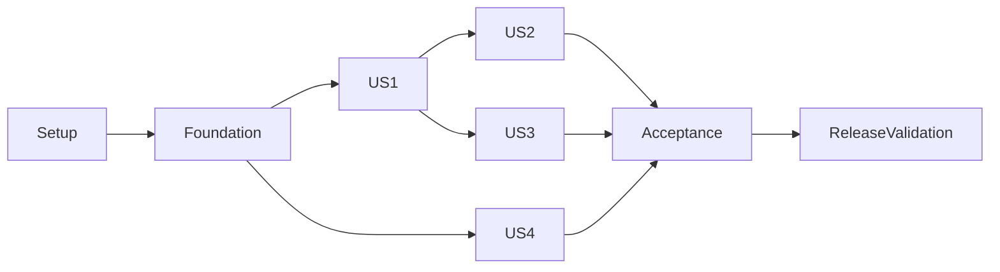

# Tasks: SMS Gateway for Tangra V4

**Input**: Design documents in `specs/001-sms-gateway-v4/`
**Prerequisites**: [plan.md](plan.md), [spec.md](spec.md), [research.md](research.md), [data-model.md](data-model.md), [contracts](contracts/), [quickstart.md](quickstart.md).
**Tests**: Required by FR-017. Write meaningful contract/security/concurrency/migration tests before their implementation. Checkboxes track implemented work; runtime acceptance remains incomplete until its prerequisites are available.
**Paths**: Repository-relative destination paths unless explicitly prefixed `../go-tangra-sms-gw`; source checkout is read-only. Source directories listed here are proposed, not existing.
**Format**: `[P]` marks disjoint work that can run together once preceding prerequisites in its phase are satisfied. `[USn]` maps tasks to stories.

## Phase 1: Setup (Shared Infrastructure)

Establish V4 module and capture the source contract before changing behavior.

- [X] T001 Capture every legacy public operation/alias, auth/error/default/uint64/status case and signed callback payload from ../go-tangra-sms-gw into tests/fixtures/legacy/ and record provenance in tests/fixtures/legacy/README.md; use mock carrier and sanitized records
- [X] T002 Create go.mod and go.sum for github.com/go-tangra/go-tangra-sms-gw/v4 with the exact local V4 framework/SDK/Go baseline in plan.md; exclude legacy common, bootstrap and Wire dependencies
- [X] T003 [P] Create Makefile generation/lint/test/integration/build/compose targets and .gitignore for secrets, UI output and local fixtures; do not copy legacy generated binaries/assets
- [X] T004 [P] Initialize ui/package.json, ui/.npmrc, ui/tsconfig.json and ui/vite.config.ts with the V4 UI kit, shared dependencies and package-token references from contracts/platform.md
- [X] T005 [P] Document source-to-destination package mapping, dependency pins and intentional compatibility changes in docs/dependencies.md and docs/compatibility.md

## Phase 2: Foundational (Blocking Prerequisites)

Provide shared trusted identity, tenant persistence and lifecycle. Checkpoint: seeded fixture repositories and protected management routing work before story implementation.

- [X] T006 Implement validated Freya configuration and legacy environment mapping in internal/config/config.go, internal/config/validate.go and deploy/dev.yaml, including separate listeners and secrets/identity references
- [X] T007 Create transactional tenant-scoped sms_* schema, reference constraints, actor distinction, revocation/audit/import tables and sequence handling in internal/store/migrations/001_initial.sql and internal/store/store.go; follow data-model.md
- [X] T008 Implement scoped repository interfaces and pgx transaction helpers for all entities in internal/repo/repo.go and internal/repo/postgres.go; enforce tenant predicates, ownership and safe list filters at the boundary
- [X] T009 [P] Implement deployment-key credential sealing and response/log redaction in internal/sealed/sealed.go and internal/sealed/redact.go using the local notification V4 pattern
- [X] T010 [P] Implement verified operator identity/permission checks with auth SDK and trusted tenant context in internal/authz/authz.go; reject forged legacy role/tenant headers and fail closed on verification failure
- [X] T011 Create Freya lifecycle, pooled SDK clients, health/readiness and cleanup wiring in internal/app/app.go and cmd/smsgwsvc/main.go; install mesh deny-by-default gateway policy in deploy/policy.yaml
- [X] T012 Create sanitized audit/login events and low-cardinality observability adapters in internal/audit/audit.go and internal/metrics/metrics.go; prohibit token/secret/body logging
- [X] T013 Build isolated seeded SQL fixtures and mock carrier/callback test harness in tests/integration/harness_test.go and tests/fixtures/seed.sql; add real PostgreSQL cross-tenant relationship/transaction checks in internal/repo/postgres_test.go

## Phase 3: User Story 1 — Preserve public SMS integrations (Priority: P1) — MVP

Public login/send/read contracts work against a mock carrier. Independent test: replay all US1 golden fixtures with two client owners and a viewer; verify 100 accepted sends and blocked sends with no persistence/carrier call.

- [X] T014 [P] [US1] Write fixture-driven public method/path/codec/error/auth and owner-isolation tests before implementation in tests/contract/public_api_test.go, including aliases, unsupported API_ADMIN and uint64/unsigned initial status representation
- [X] T015 [P] [US1] Write send pipeline tests before implementation in internal/sms/send_test.go for disabled records, foreign tenant references, active blocks, invalid/missing template properties and uncertain carrier response without resend
- [X] T016 [US1] Port Hermes JWT issuer, bcrypt password checks, access/refresh distinction, login/logout/refresh/current-client behavior and persistent revocation into internal/auth/jwt.go, internal/auth/password.go and internal/auth/service.go; preserve source claims and token TTL behavior
- [X] T017 [P] [US1] Port provider sender interface/type registry, configuration metadata, Voicecom request/response adapter and exact status mapping into internal/provider/provider.go, internal/provider/registry.go and internal/provider/voicecom/voicecom.go
- [X] T018 [P] [US1] Port bounded template rendering and source GSM/Unicode multipart calculations into internal/render/render.go and internal/render/length.go; retain SMS-only behavior
- [X] T019 [P] [US1] Port source login/send rate limits and trusted proxy address handling into internal/ratelimit/limiter.go and internal/trustedproxy/trusted.go; document configured defaults
- [X] T020 [US1] Implement validated block-before-render/persist send orchestration, pre-carrier UUID record, actor/tenant checks and conditional provider-response status persistence in internal/sms/send.go; prevent early DLR terminal state overwrite
- [X] T021 [US1] Implement owned message/receipt queries and safe source-compatible paging/filtering in internal/sms/query.go and internal/repo/messages.go; return no foreign-client/tenant records
- [X] T022 [US1] Implement exact Hermes wire routes/codecs/errors on the dedicated public listener in internal/publicapi/server.go and internal/publicapi/codec.go; reserve literal receipt routes and do not mount management handlers
- [X] T023 [US1] Wire public auth/send/query and repository-backed service startup in internal/app/public.go; run tests/contract/public_api_test.go and record US1 parity/security exceptions in docs/compatibility.md

## Phase 4: User Story 2 — Reliable delivery tracking (Priority: P1)

Carrier receipts and signed callbacks preserve the source behavior under concurrency. Independent test: seed a message without US1 requests and execute receipt sequences and local callback checks.

- [X] T024 [P] [US2] Write token validation, 200 DLR_OK, 100-concurrent-callback aggregation, early DLR and terminal-race tests before implementation in internal/dlr/processor_test.go and tests/contract/dlr_test.go
- [X] T025 [P] [US2] Write exact outbound signature/payload, retries, queue overflow, redirect/private-DNS blocking and cancellation tests before implementation in internal/webhook/dispatcher_test.go
- [X] T026 [US2] Implement constant-time receipt secret validation, stored-message tenant resolution, atomic upsert/parts increment, parent locking and terminal-state preservation in internal/dlr/processor.go and internal/repo/receipts.go
- [X] T027 [US2] Implement source-compatible GET /dlr and /hermes/v1/sms/dlr query binding/acknowledgement in internal/publicapi/dlr.go; sanitize rejected-callback telemetry and never mutate on bad token
- [X] T028 [US2] Port bounded dispatcher, six-attempt backoff, HMAC timestamp/signature, safe dial-time URL resolution and no-redirect behavior into internal/webhook/dispatcher.go and internal/webhook/safe_url.go
- [X] T029 [US2] Wire cancellable receipt/callback lifecycle after committed receipt writes in internal/app/dlr.go and add poll/push/restart acceptance scenarios in tests/integration/delivery_test.go; document best-effort queue semantics in docs/operations.md

## Phase 5: User Story 3 — V4 portal administration (Priority: P1)

Operators administer every existing gateway area under V4 permission and tenant checks. Independent test: seed data, register with real auth/portal, exercise administrator/sender/viewer in two tenants and direct backend denial cases.

- [X] T030 [P] [US3] Define complete management schemas, endpoints, permission/limit extensions and sanitized error DTOs in api/openapi/sms-gw.yaml according to contracts/management-api.md; embed via api/openapi/embed.go
- [X] T031 [P] [US3] Write administrator/sender/viewer, tenant-isolation, secret-redaction, forged-header and public-listener exclusion tests before implementation in tests/contract/management_test.go
- [X] T032 [US3] Implement provider/type, template/preview, API client/password reset and block handlers with same-tenant references, secret sealing and sanitized DTOs in internal/httpapi/providers.go, internal/httpapi/templates.go, internal/httpapi/clients.go and internal/httpapi/blocks.go
- [X] T033 [US3] Implement message filters/details/receipt views and separate-platform-actor manual send in internal/httpapi/messages.go; reuse domain pipeline and preview/parts calculations
- [X] T034 [US3] Port constrained instant/range dashboard query service, existing metric definitions/window presets and unavailable-monitoring handling into internal/metrics/dashboard.go and internal/httpapi/dashboard.go
- [X] T035 [US3] Implement OpenAPI validation, verified permission middleware, bounded body/query handling and strict handler/manifest parity in internal/httpapi/server.go and internal/httpapi/middleware.go
- [X] T036 [US3] Build module manifest/routes/roles/abilities/nav from OpenAPI in pkg/smsgwmanifest/manifest.go; test permission declaration and route parity in pkg/smsgwmanifest/manifest_test.go
- [X] T037 [US3] Implement portal gatewayclient lease registration and separate auth permission/role registration/retry workers in internal/app/registration.go and internal/app/permissions.go; register only after ready with real endpoints
- [X] T038 [US3] Create V4 federation exports, shell API integration, generated API types, shared schemas and embedded remote assets in ui/module-federation.config.ts, ui/src/routes.ts, ui/src/nav.ts, ui/src/api/client.ts, ui/src/api/schema.d.ts, ui/embed.go and ui/embed_stub.go
- [X] T039 [P] [US3] Implement permission-gated provider metadata forms and secret-safe client/password-reset screens in ui/src/pages/Providers.vue and ui/src/pages/ApiClients.vue
- [X] T040 [P] [US3] Implement template CRUD/preview and global/provider block screens in ui/src/pages/Templates.vue and ui/src/pages/Blocks.vue
- [X] T041 [P] [US3] Implement message filtering/details/receipt history, manual send variable preview/parts and monitoring windows/unavailable state in ui/src/pages/Messages.vue, ui/src/components/SendDrawer.vue and ui/src/pages/Dashboard.vue
- [X] T042 [US3] Add role/tenant/form tests and real-portal remote/export/navigation/accessibility validation in ui/src/tests/management.spec.ts and ui/tests/e2e/portal.spec.ts; run lint/typecheck/build and test built exports against pkg/smsgwmanifest/manifest.go

## Phase 6: User Story 4 — Migration and operation (Priority: P2)

Import an isolated legacy snapshot and operate under V4 identity/TLS/lifecycle conventions. Independent test: dry-run, apply twice, reconcile all entities then rehearse restart/identity/certificate/retention/rollback with seeded services.

- [ ] T043 [P] [US4] Write representative all-entity import/reconciliation tests before implementation in internal/migrate/import_test.go, including preserved hashes/IDs/timestamps/sequences, conflicts/orphans, resealing, dry-run and repeated apply
- [ ] T044 [P] [US4] Write identity rotation/expiry, registration outage/recovery, public TLS failure/ACME cache and retention boundary acceptance tests before implementation in tests/integration/operations_test.go
- [ ] T045 [US4] Implement read-only source configuration, explicit tenant mapping, fingerprint/checkpoints, validation/dry-run, transactional import and sequence reconciliation in internal/migrate/import.go and cmd/smsgw-migrate/main.go; create deploy/legacy-import.dev.yaml without credentials
- [ ] T046 [US4] Implement idempotent bootstrap/migrations and version commands in cmd/smsgwsvc/bootstrap.go and cmd/smsgwsvc/version.go; no implicit sample accounts
- [X] T047 [US4] Implement optional LCM network identity enrollment with the SDK and framework provider lifecycle in internal/identity/lcm.go and internal/app/identity.go; verify protected readiness/expiry and pooled-client rotation
- [ ] T048 [US4] Port optional static public HTTPS, ACME challenges/issuance/renewal/persistent cache and nonfatal configuration errors into internal/publicapi/tls.go and internal/acme/acme.go; preserve separate internal/public keys
- [ ] T049 [US4] Port tenant/provider-scoped retention worker with zero-retention preservation and transactional message/receipt deletion into internal/housekeeper/housekeeper.go; wire cancellation/drain in internal/app/workers.go
- [ ] T050 [US4] Build local PostgreSQL/mock-carrier/callback/ACME deployment and V4 service connections in deploy/compose.yaml and deploy/init-db.sql, with isolated networks/ports, mounted identity/cache and explicit development-only exemptions
- [ ] T051 [US4] Document config/env compatibility, metrics, enrollment/rotation, failure diagnosis, secret/cache persistence and bootstrap operations in docs/operations.md; document dry-run/apply/reconciliation, pause/drain/cutover and post-traffic rollback in docs/migration.md
- [ ] T052 [US4] Run migration twice and operations/rollback rehearsal from specs/001-sms-gateway-v4/quickstart.md; record source/destination entity counts and identity/TLS/retention outcomes in docs/validation.md

## Phase 7: Polish & Cross-Cutting Concerns

Produce a reproducible release candidate and consolidated acceptance evidence. This phase requires all four stories.

- [ ] T053 [P] Create nonroot multi-stage Go/UI Dockerfile with BuildKit npm secret, version injection and no embedded identity/key material; verify UI embed and public ACME volume ownership
- [ ] T054 [P] Create .github/workflows/ci.yaml with Go vet/race/build, contract/manifest and PostgreSQL integration, UI lint/typecheck/tests/build and image build checks; keep credentials out of artifacts
- [ ] T055 Complete real V4 auth/portal/LCM with mock carrier end-to-end acceptance in tests/integration/platform_test.go; cover all FR-001–017 and SC-001–006 including 100 sends and receipt aggregation
- [ ] T056 Publish setup/build/API/permissions/config documentation in README.md and final contract/requirement-to-test reconciliation in docs/validation.md; run the quickstart commands and report actual results and any unavailable prerequisite explicitly

## Dependencies & Execution Order

- Setup T001–T005 precedes foundation T006–T013. Capture fixtures before public adapter changes; module/config precedes storage and framework wiring. T008 repository helpers depend on T007 schema; T011 lifecycle depends on config and operator auth; T013 harness depends on repository/lifecycle support.
- US1 T014–T023 follows foundation. JWT/provider/render/proxy tasks can run concurrently after tests are written; send follows those domain prerequisites; public routing/wiring follows send and query. US1 is the smallest mock-carrier send/read MVP, without full carrier callback ingestion or portal administration.
- US2 T024–T029 follows foundation and shared provider status/record semantics (T017 and T020). Seeded messages allow independent tests; complete end-to-end polling integrates US1. Transactional receipt implementation precedes HTTP receipt wiring and dispatcher integration.
- US3 T030–T042 follows foundation. CRUD/preview depends on shared renderer/provider registry (T017–T018); manual send depends on T020. OpenAPI precedes handler/manifest generation; manifest precedes registration; API contract/federation scaffolding precedes disjoint pages; page implementation precedes UI acceptance.
- US4 T043–T052 follows foundation for seeded import/operation tests; full cutover acceptance requires US1–US3. Import follows its fixture tests and sealing/schema; identity/TLS/retention workers follow lifecycle; deployment and operational docs precede rehearsal.
- Polish T053–T056 requires the implemented stories; final platform acceptance follows deployment and build artifacts. CI/image authoring can run together once build targets and contracts exist.

The graph shows conservative integration order. Seeded-data US2/US3/US4 verification does not require a UI/public journey; their complete delivery still shares the domain primitives identified above.

## Parallel Examples

- **Setup**: after T002, T003 Makefile, T004 UI initialization and T005 mapping docs use distinct files.
- **Foundation**: T009 secret sealing and T010 operator auth use distinct packages; finish both before protected credential management.
- **US1**: T014 contract and T015 send tests can run together; after test capture T017 provider, T018 renderer and T019 proxy/limits are disjoint.
- **US2**: T024 receipt tests and T025 webhook tests can run together. Receipt persistence and callback dispatch share an integration checkpoint at T029.
- **US3**: T030 OpenAPI and T031 management test design can run together; after T038 federation/API scaffolding, T039 provider/client pages, T040 template/block pages and T041 messages/dashboard pages are disjoint.
- **US4**: T043 import tests and T044 operational tests can run together against isolated fixtures; implementation shares foundation/lifecycle and should be integrated sequentially.
- **Polish**: T053 image and T054 CI authoring are disjoint after build conventions settle.

## Implementation Strategy

Complete setup and foundation, then deliver US1 as a public mock-carrier MVP and verify compatibility. Add US2 receipts/callbacks, then US3 V4 portal administration; exercise each seeded slice and rerun affected contract checks. Add US4 import/operations and run the full V4 acceptance stack before considering production cutover. No production rollout, carrier send or source mutation is authorized by these planning tasks.

## Requirement Coverage

| Requirement | Principal tasks |
|---|---|
| FR-001–002 | T001, T014, T016, T021–T023 |
| FR-003–005 | T015, T017–T020 |
| FR-006–008 | T020–T021, T024–T029 |
| FR-009 | T010–T011, T035–T038, T055 |
| FR-010 | T030–T042 |
| FR-011 | T007–T008, T013–T015, T020–T021, T026, T031–T033 |
| FR-012 | T009, T012, T031–T032, T039, T045, T055 |
| FR-013 | T006, T011, T037, T044, T046–T047, T051–T052 |
| FR-014 | T044, T048, T050, T053 |
| FR-015 | T019, T034, T044, T049–T052 |
| FR-016 | T043, T045, T051–T052 |
| FR-017 / SC-001–006 | T013–T015, T023–T025, T029, T031, T036, T042–T044, T052, T054–T056 |

## Notes

- Keep all IDs sequential and story labels present in story phases. Tests must assess behavior rather than duplicate implementation.
- Golden fixtures normalize only nondeterministic IDs/timestamps/tokens after verifying their semantics; never normalize away contract regressions.
- No Git branch was created because this workspace has no usable Git metadata and no branch extension hook. Speckit feature discovery uses `.specify/feature.json`.
- No extension hooks are configured; before/after specify, plan and tasks hook checks are skipped. The constitution remains an unratified template.

## Implementation progress — 2026-10-04

- Phase 1 complete. T001: `scripts/capture_legacy_runtime.py` recorded 154 database-backed cases from the running legacy service (isolated PostgreSQL, legacy mock carrier, in-process failure carrier and callback receiver) into `tests/fixtures/legacy/runtime/`; findings and deliberate V4 changes are in `docs/compatibility.md`.
- Phase 2 complete (T006–T013): config with legacy env mapping (`internal/config`), tenant schema with RLS and composite FKs (`internal/store/migrations/001_initial.sql`), repositories (`internal/repo`), sealing/redaction (`internal/sealed`), operator authz (`internal/authz`), Freya lifecycle/admin/readiness (`internal/app`, `cmd/smsgwsvc`, `deploy/policy.yaml`), audit and metrics (`internal/audit`, `internal/metrics`), seeded harness (`tests/fixtures/seed.sql`, `tests/integration`). `go vet` and `go test -race` pass with and without `-tags integration` (integration suites skip without docker or `SMSGW_TEST_PG_DSN`).
- Phase 3 (US1) complete (T014–T023): Hermes auth with persistent revocation (`internal/auth`), shared public errors/caller (`internal/hermes`), provider registry/cache and Voicecom (`internal/provider`), bounded rendering and part counts (`internal/render`), limiter and trusted proxies (`internal/ratelimit`, `internal/trustedproxy`), send pipeline and owned queries (`internal/sms`, `internal/repo/messages.go`), exact wire adapter (`internal/publicapi`) and wiring (`internal/app/public.go`, bound in `app.Build`). `tests/contract/public_api_test.go` replays the legacy capture (154 cases accounted for; deliberate differences listed in `docs/compatibility.md`); `tests/integration/public_test.go` is the two-tenant, 100-send independent test. Receipt routes were reserved for US2 (now wired, see Phase 4). Receipt ids no longer skip on duplicate receipts (`Tx.AddReceipt` updates in place first). Static public HTTPS/ACME remain T048 (a warning is logged when configured).
- Phase 4 (US2) complete (T024–T029): receipt processor (`internal/dlr`), atomic `ApplyReceipt` (`internal/repo/receipts.go`), receipt binding/acknowledgement and rejected-receipt budget (`internal/publicapi/dlr.go`), callback dispatcher and destination checks (`internal/webhook`), wiring (`internal/app/dlr.go`). The legacy replay now sends every receipt over HTTP: 154 cases, 146 replayed, 8 observations, nothing deferred. Decisions (receipt limit charged by rejected receipts only, digest token comparison, refused destinations not retried, shutdown cancels callbacks) are in `docs/compatibility.md`; queue semantics in `docs/operations.md`. Management must validate callback URLs with `webhook.ValidateURL` and seal secrets with `sealed.CallbackAD` (US3).
- Phase 5 (US3) backend complete (T030–T037): OpenAPI contract `api/openapi/sms-gw.yaml` (29 operations, snake_case DTOs, platform list contract) embedded by `api/openapi`; management API `internal/httpapi` (route match → operator token + permission → bounded body → OpenAPI validation → handler; handlers installed with their permission, construction fails on any undeclared/mismatched/missing route); providers with write-only credentials (one-time `generated_secrets.dlr_token`), templates with variables and preview, API clients (one-time generated passwords, callback URL policy, sealed secrets), blocks, messages with manual send through `sms.Service.Send` as a platform actor, receipts, dashboard (`internal/metrics/dashboard.go`, predefined queries only); `pkg/smsgwmanifest` (permissions, roles administrator/sender/viewer, owner/admin grants, abilities, nav `/sms-gw/*`, exposes `./routes` `./nav`); lease registration and auth registration workers start after readiness (`internal/app/registration.go`, `permissions.go`; `Options.NoRegistration` for tests). Repository lists gained spec-based sorting, search and last-page clamp (`internal/repo/lists.go`) and sealed creates bound to the new row id. Decisions are in `docs/compatibility.md` (V4 management API) and `docs/operations.md`.
- T047 done early because stack registration needs it: `enroll.enabled` now enrolls via `lcmidentity.NewNet` (`internal/app/identity.go`); live expiry/rotation evidence stays with T044/T052.
- Phase 5 (US3) UI (T038–T042 done): Vue remote `sms-gw` in `ui/` (routes `/sms-gw/{providers,templates,api-clients,blocks,messages,dashboard}` gated by the manifest permissions, CASL abilities hide write actions, server-paged tables with keyboard rows, one-time secret dialog, template/manual-send preview with parts, receipt history, dashboard with explicit unavailable state); `ui/embed.go`/`embed_stub.go` served by `cmd/smsgwsvc` through `app.Options.Remote`; `Dockerfile` (node UI build with `npm_token` secret, Go `-tags ui`, distroless). T042: unit tests and the built-export check pass; `ui/tests/e2e/portal.spec.ts` passed through the real portal in the local freya-stack (6/6 read-only, 9/9 with `E2E_MUTATE=1`). The run found two UI bugs, fixed in 79d3a01 (deleting from a drawer hid the shell's confirmation under it; the template preview never reported blank properties as missing), and spec issues fixed in 187762e.
- Earlier UI note: types come from `api/openapi/sms-gw.yaml`; `app.Options.Remote` (an `fs.FS`) serves the remote under `/ui/` with immutable hashed assets; manifest exposes `./routes` and `./nav` only.
- Local freya-stack run (2026-10-04, see `docs/validation.md`): the image enrolled over lcm, holds the gateway lease for `/api/sms-gw` and `/m/sms-gw/`, registered permissions and the three module roles with auth, and the public Hermes path (login, send through a mock Voicecom carrier, receipt, signed client callback) worked. This is a workstation stack, not T050's repository deployment files, so T050 stays open.
